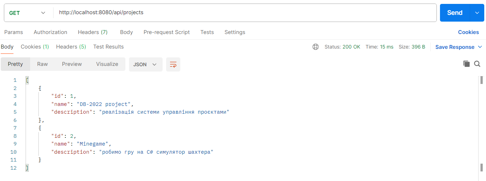

# Тестування працездатності системи

*В цьому розділі необхідно вказати засоби тестування, навести вихідні коди тестів та результати тестування.*
*Тестування виконується за допомогою Postman*
*Буде демонструватись тестування самої системи проєктів: створення проєкту, добавлення туди учасників/завдань і т.д.*

## GET

### Отримати всіх користувачів

### Отримати всі ролі

### Отримати всі проєкти

### Отримати всіх учасників проєкту

### Отримати всі завдання проєкту

### Отримати всі проєкти користувача

## POST

### Створити користувача

### Створити роль

### Створити проєкт

### Добавити учасника до проєкту

### Добавити завдання до проєкту

## DELETE

### Видалити учасника з проєкту

### Видалити завдання з проєкту

